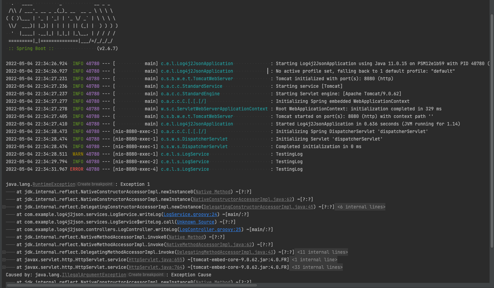

## [Log4J2 with JSON Template Layout](https://logging.apache.org/log4j/2.x/manual/json-template-layout.html)

## Introdução

Projeto SpringBoot Web com Groovy/Java explicando como configurar o Log4j2 para imprimir os logs em formato JSON.

## Tecnologias

* SpringBoot 2.6.7
    * spring-boot-starter-web
    * spring-boot-starter-log4j2
* Java 11
* Groovy 3.0.10
* Gradle 7.4.1

## Explicação

Por padrão o SpringBoot usa o Logstash como implementação de logs, vamos substituir pelo Log4j2 e fazer as configurações necessárias para imprimir os logs no formato JSON.

### Dependências

1. Remover a dependência do Logstash de todas as dependências Spring adicionando o trecho abaixo no [build.gradle](build.gradle)
   ```gradle
   configurations {
       all*.exclude module: 'spring-boot-starter-logging'
   }
   ```
2. Adicionar as dependencias do log4j2 e das configurações no [build.gradle](build.gradle):
     ```gradle
    implementation 'org.springframework.boot:spring-boot-starter-log4j2'
    implementation 'org.apache.logging.log4j:log4j-layout-template-json'
    implementation 'com.fasterxml.jackson.dataformat:jackson-dataformat-yaml'
    ```
    1. `spring-boot-starter-log4j2` → módulo do Spring com as depências mínimas do Log4j2;
    2. `log4j-layout-template-json` → biblioteca que exporta o log no formato JSON;
    3. `jackson-dataformat-yaml` → biblioteca opcional para usarmos o arquivo de configuração do Log4j2 no formato *log4j2.yaml* em vez de *log4j2.properties*
    4. Pode ser necessário adicionar `jackson-databind`, como esse projeto é spring-web, já tem essa
       dependência. [Mais informações](https://logging.apache.org/log4j/2.x/runtime-dependencies.html)

### Configuração

Adicionar o arquivo de configuração [src/main/resources/log4j2.yaml](src/main/resources/log4j2.yaml)

```yaml
Configuration:
    status: warn
    appenders:
        Console:
            -   name: JSON_LAYOUT_APPENDER
                target: SYSTEM_OUT
                follow: true
                JsonTemplateLayout:
                    eventTemplateUri: classpath:EcsLayout.json
    Loggers:
        Root:
            level: info
            additivity: false
            AppenderRef:
                ref: JSON_LAYOUT_APPENDER
```

Na propriedade `eventTemplateUri: classpath:EcsLayout.json` definimos o template desejado.
Tem vários templates disponíveis: `EcsLayout, LogstashJsonEventLayoutV1, GelfLayout, GcpLayout, JsonLayout`.
Apenas com essa configuração já temos o log impresso no formato JSON:

* Log Padrão Spring
  

---

* Log Json com EcsLayout
  

---

```json
{
    "@timestamp": "2022-05-04T23:41:49.008Z",
    "ecs.version": "1.2.0",
    "log.level": "INFO",
    "message": "Started Log4j2JsonApplication in 0.653 seconds (JVM running for 1.227)",
    "process.thread.name": "main",
    "log.logger": "com.example.log4j2json.Log4j2JsonApplication"
}
```

### JsonTemplateLayout Customizado

Podemos criar um JsonTemplateLayout customizado [resources/log4j2-meu-template.json](src/main/resources/log4j2-meu-template.json) e
alterar no arquivo de configuração [src/main/resources/log4j2.yaml](src/main/resources/log4j2.yaml) para usá-lo: `eventTemplateUri: classpath:log4j2-meu-template.json`

Existem vários *resolvers* disponíveis: `counter, timestamp, level, caseConverter, message, thread, logger, source, exception, mdc, ndc`

#### Estrutura do JsonTemplateLayout customizado

```json
{
    "idx": {
        "$resolver": "counter",
        "start": 1
    },
    "log_date": {
        "$resolver": "timestamp",
        "pattern": {
            "format": "yyyy-MM-dd'T'HH:mm:ss.SSS'Z'",
            "timeZone": "UTC"
        }
    },
    "nanos": {
        "$resolver": "timestamp",
        "epoch": {
            "unit": "nanos"
        }
    },
    "level": {
        "$resolver": "level",
        "field": "name"
    },
    "level_lower": {
        "$resolver": "caseConverter",
        "case": "lower",
        "input": {
            "$resolver": "level",
            "field": "name"
        }
    },
    "level_code": {
        "$resolver": "level",
        "field": "severity",
        "severity": {
            "field": "code"
        }
    },
    "message": {
        "$resolver": "message",
        "stringified": true
    },
    "thread_name": {
        "$resolver": "thread",
        "field": "name"
    },
    "logger_name": {
        "$resolver": "logger",
        "field": "name"
    },
    "class": {
        "$resolver": "source",
        "field": "className"
    },
    "resource": {
        "service.name": "log4j2-json",
        "java.version": "${sys:java.version}"
    },
    "exception": {
        "type": {
            "$resolver": "exception",
            "field": "className"
        },
        "message": {
            "$resolver": "exception",
            "field": "message"
        },
        "stacktrace": {
            "$resolver": "exception",
            "field": "stackTrace",
            "stackTrace": {
                "stringified": true
            }
        }
    }
}

```

#### Resultado dos logs com JsonTemplateLayout customizado:


---

```json
{
    "log_date": "2022-05-04T23:53:55.572Z",
    "nanos": 1651708435572993000,
    "level": "INFO",
    "level_code": 6,
    "message": "Started Log4j2JsonApplication in 0.931 seconds (JVM running for 2.094)",
    "thread_name": "main",
    "logger_name": "com.example.log4j2json.Log4j2JsonApplication",
    "resource": {
        "service.name": "log4j2-json",
        "java.version": "11.0.15"
    }
}
```

#### Resultado dos logs com exceção

* EcsLayout:
    ```json
    {
      "@timestamp": "2022-05-04T23:59:00.288Z",
      "ecs.version": "1.2.0",
      "log.level": "ERROR",
      "message": "TestingLog",
      "process.thread.name": "http-nio-8080-exec-5",
      "log.logger": "com.example.log4j2json.services.LogService",
      "error.type": "java.lang.RuntimeException",
      "error.message": "Exception 1",
      "error.stack_trace": "java.lang.RuntimeException: Exception 1\n\tat java.base/jdk.internal.reflect.NativeConstructorAccessorImpl.newInstance0(Native Method)\n\tat java.base/jdk.internal.reflect.NativeConstructorAccessorImpl.newInstance(NativeConstructorAccessorImpl.java:62)\n\tat java.base/jdk.internal.reflect.DelegatingConstructorAccessorImpl.newInstance(DelegatingConstructorAccessorImpl.java:45)\n\tat java.base/java.lang.reflect.Constructor.newInstance(Constructor.java:490)\n\tat org.codehaus.groovy.reflection.CachedConstructor.invoke(CachedConstructor.java:72)\n\tat org.codehaus.groovy.runtime.callsite.ConstructorSite$ConstructorSiteNoUnwrapNoCoerce.callConstructor(ConstructorSite.java:105)\n\tat org.codehaus.groovy.runtime.callsite.AbstractCallSite.callConstructor(AbstractCallSite.java:286)\n\tat com.example.log4j2json.services.LogService.writeLog(LogService.groovy:23)\n\tat com.example.log4j2json.services.LogService$writeLog.call(Unknown Source)\n\tat com.example.log4j2json.controllers.LogController.writeLog(LogController.groovy:25)\n\tat java.base/jdk.internal.reflect.NativeMethodAccessorImpl.invoke0(Native Method)\n\tat java.base/jdk.internal.reflect.NativeMethodAccessorImpl.invoke(NativeMethodAccessorImpl.java:62)\n\tat java.base/jdk.internal.reflect.DelegatingMethodAccessorImpl.invoke(DelegatingMethodAccessorImpl.java:43)\n\tat java.base/java.lang.reflect.Method.invoke(Method.java:566)\n\tat org.springframework.web.method.support.InvocableHandlerMethod.doInvoke(InvocableHandlerMethod.java:205)\n\tat org.springframework.web.method.support.InvocableHandlerMethod.invokeForRequest(InvocableHandlerMethod.java:150)\n\tat org.springframework.web.servlet.mvc.method.annotation.ServletInvocableHandlerMethod.invokeAndHandle(ServletInvocableHandlerMethod.java:117)\n\tat org.springframework.web.servlet.mvc.method.annotation.RequestMappingHandlerAdapter.invokeHandlerMethod(RequestMappingHandlerAdapter.java:895)\n\tat org.springframework.web.servlet.mvc.method.annotation.RequestMappingHandlerAdapter.handleInternal(RequestMappingHandlerAdapter.java:808)\n\tat org.springframework.web.servlet.mvc.method.AbstractHandlerMethodAdapter.handle(AbstractHandlerMethodAdapter.java:87)\n\tat org.springframework.web.servlet.DispatcherServlet.doDispatch(DispatcherServlet.java:1067)\n\tat org.springframework.web.servlet.DispatcherServlet.doService(DispatcherServlet.java:963)\n\tat org.springframework.web.servlet.FrameworkServlet.processRequest(FrameworkServlet.java:1006)\n\tat org.springframework.web.servlet.FrameworkServlet.doGet(FrameworkServlet.java:898)\n\tat javax.servlet.http.HttpServlet.service(HttpServlet.java:655)\n\tat org.springframework.web.servlet.FrameworkServlet.service(FrameworkServlet.java:883)\n\tat javax.servlet.http.HttpServlet.service(HttpServlet.java:764)\n\tat org.apache.catalina.core.ApplicationFilterChain.internalDoFilter(ApplicationFilterChain.java:227)\n\tat org.apache.catalina.core.ApplicationFilterChain.doFilter(ApplicationFilterChain.java:162)\n\tat org.apache.tomcat.websocket.server.WsFilter.doFilter(WsFilter.java:53)\n\tat org.apache.catalina.core.ApplicationFilterChain.internalDoFilter(ApplicationFilterChain.java:189)\n\tat org.apache.catalina.core.ApplicationFilterChain.doFilter(ApplicationFilterChain.java:162)\n\tat org.springframework.web.filter.RequestContextFilter.doFilterInternal(RequestContextFilter.java:100)\n\tat org.springframework.web.filter.OncePerRequestFilter.doFilter(OncePerRequestFilter.java:117)\n\tat org.apache.catalina.core.ApplicationFilterChain.internalDoFilter(ApplicationFilterChain.java:189)\n\tat org.apache.catalina.core.ApplicationFilterChain.doFilter(ApplicationFilterChain.java:162)\n\tat org.springframework.web.filter.FormContentFilter.doFilterInternal(FormContentFilter.java:93)\n\tat org.springframework.web.filter.OncePerRequestFilter.doFilter(OncePerRequestFilter.java:117)\n\tat org.apache.catalina.core.ApplicationFilterChain.internalDoFilter(ApplicationFilterChain.java:189)\n\tat org.apache.catalina.core.ApplicationFilterChain.doFilter(ApplicationFilterChain.java:162)\n\tat org.springframework.web.filter.CharacterEncodingFilter.doFilterInternal(CharacterEncodingFilter.java:201)\n\tat org.springframework.web.filter.OncePerRequestFilter.doFilter(OncePerRequestFilter.java:117)\n\tat org.apache.catalina.core.ApplicationFilterChain.internalDoFilter(ApplicationFilterChain.java:189)\n\tat org.apache.catalina.core.ApplicationFilterChain.doFilter(ApplicationFilterChain.java:162)\n\tat org.apache.catalina.core.StandardWrapperValve.invoke(StandardWrapperValve.java:197)\n\tat org.apache.catalina.core.StandardContextValve.invoke(StandardContextValve.java:97)\n\tat org.apache.catalina.authenticator.AuthenticatorBase.invoke(AuthenticatorBase.java:541)\n\tat org.apache.catalina.core.StandardHostValve.invoke(StandardHostValve.java:135)\n\tat org.apache.catalina.valves.ErrorReportValve.invoke(ErrorReportValve.java:92)\n\tat org.apache.catalina.core.StandardEngineValve.invoke(StandardEngineValve.java:78)\n\tat org.apache.catalina.connector.CoyoteAdapter.service(CoyoteAdapter.java:360)\n\tat org.apache.coyote.http11.Http11Processor.service(Http11Processor.java:399)\n\tat org.apache.coyote.AbstractProcessorLight.process(AbstractProcessorLight.java:65)\n\tat org.apache.coyote.AbstractProtocol$ConnectionHandler.process(AbstractProtocol.java:890)\n\tat org.apache.tomcat.util.net.NioEndpoint$SocketProcessor.doRun(NioEndpoint.java:1743)\n\tat org.apache.tomcat.util.net.SocketProcessorBase.run(SocketProcessorBase.java:49)\n\tat org.apache.tomcat.util.threads.ThreadPoolExecutor.runWorker(ThreadPoolExecutor.java:1191)\n\tat org.apache.tomcat.util.threads.ThreadPoolExecutor$Worker.run(ThreadPoolExecutor.java:659)\n\tat org.apache.tomcat.util.threads.TaskThread$WrappingRunnable.run(TaskThread.java:61)\n\tat java.base/java.lang.Thread.run(Thread.java:829)\nCaused by: java.lang.IllegalArgumentException: Exception Cause\n\tat java.base/jdk.internal.reflect.NativeConstructorAccessorImpl.newInstance0(Native Method)\n\tat java.base/jdk.internal.reflect.NativeConstructorAccessorImpl.newInstance(NativeConstructorAccessorImpl.java:62)\n\tat java.base/jdk.internal.reflect.DelegatingConstructorAccessorImpl.newInstance(DelegatingConstructorAccessorImpl.java:45)\n\tat java.base/java.lang.reflect.Constructor.newInstance(Constructor.java:490)\n\tat org.codehaus.groovy.reflection.CachedConstructor.invoke(CachedConstructor.java:72)\n\tat org.codehaus.groovy.runtime.callsite.ConstructorSite$ConstructorSiteNoUnwrapNoCoerce.callConstructor(ConstructorSite.java:105)\n\tat org.codehaus.groovy.runtime.callsite.AbstractCallSite.callConstructor(AbstractCallSite.java:277)\n\t... 53 more\n"
    }
    ```
* JsonTemplateLayout customizado:
    ```json
    {
        "log_date": "2022-05-04T23:56:41.159Z",
        "nanos": 1651708601159476000,
        "level": "ERROR",
        "level_code": 3,
        "message": "TestingLog",
        "thread_name": "http-nio-8080-exec-1",
        "logger_name": "com.example.log4j2json.services.LogService",
        "resource": {
            "service.name": "log4j2-json",
            "java.version": "11.0.15"
        },
        "exception": {
            "type": "java.lang.RuntimeException",
            "message": "Exception 1",
            "stacktrace": "java.lang.RuntimeException: Exception 1\n\tat java.base/jdk.internal.reflect.NativeConstructorAccessorImpl.newInstance0(Native Method)\n\tat java.base/jdk.internal.reflect.NativeConstructorAccessorImpl.newInstance(NativeConstructorAccessorImpl.java:62)\n\tat java.base/jdk.internal.reflect.DelegatingConstructorAccessorImpl.newInstance(DelegatingConstructorAccessorImpl.java:45)\n\tat java.base/java.lang.reflect.Constructor.newInstance(Constructor.java:490)\n\tat org.codehaus.groovy.reflection.CachedConstructor.invoke(CachedConstructor.java:72)\n\tat org.codehaus.groovy.runtime.callsite.ConstructorSite$ConstructorSiteNoUnwrapNoCoerce.callConstructor(ConstructorSite.java:105)\n\tat org.codehaus.groovy.runtime.callsite.CallSiteArray.defaultCallConstructor(CallSiteArray.java:59)\n\tat org.codehaus.groovy.runtime.callsite.AbstractCallSite.callConstructor(AbstractCallSite.java:263)\n\tat org.codehaus.groovy.runtime.callsite.AbstractCallSite.callConstructor(AbstractCallSite.java:286)\n\tat com.example.log4j2json.services.LogService.writeLog(LogService.groovy:23)\n\tat com.example.log4j2json.services.LogService$writeLog.call(Unknown Source)\n\tat org.codehaus.groovy.runtime.callsite.CallSiteArray.defaultCall(CallSiteArray.java:47)\n\tat org.codehaus.groovy.runtime.callsite.AbstractCallSite.call(AbstractCallSite.java:125)\n\tat org.codehaus.groovy.runtime.callsite.AbstractCallSite.call(AbstractCallSite.java:148)\n\tat com.example.log4j2json.controllers.LogController.writeLog(LogController.groovy:25)\n\tat java.base/jdk.internal.reflect.NativeMethodAccessorImpl.invoke0(Native Method)\n\tat java.base/jdk.internal.reflect.NativeMethodAccessorImpl.invoke(NativeMethodAccessorImpl.java:62)\n\tat java.base/jdk.internal.reflect.DelegatingMethodAccessorImpl.invoke(DelegatingMethodAccessorImpl.java:43)\n\tat java.base/java.lang.reflect.Method.invoke(Method.java:566)\n\tat org.springframework.web.method.support.InvocableHandlerMethod.doInvoke(InvocableHandlerMethod.java:205)\n\tat org.springframework.web.method.support.InvocableHandlerMethod.invokeForRequest(InvocableHandlerMethod.java:150)\n\tat org.springframework.web.servlet.mvc.method.annotation.ServletInvocableHandlerMethod.invokeAndHandle(ServletInvocableHandlerMethod.java:117)\n\tat org.springframework.web.servlet.mvc.method.annotation.RequestMappingHandlerAdapter.invokeHandlerMethod(RequestMappingHandlerAdapter.java:895)\n\tat org.springframework.web.servlet.mvc.method.annotation.RequestMappingHandlerAdapter.handleInternal(RequestMappingHandlerAdapter.java:808)\n\tat org.springframework.web.servlet.mvc.method.AbstractHandlerMethodAdapter.handle(AbstractHandlerMethodAdapter.java:87)\n\tat org.springframework.web.servlet.DispatcherServlet.doDispatch(DispatcherServlet.java:1067)\n\tat org.springframework.web.servlet.DispatcherServlet.doService(DispatcherServlet.java:963)\n\tat org.springframework.web.servlet.FrameworkServlet.processRequest(FrameworkServlet.java:1006)\n\tat org.springframework.web.servlet.FrameworkServlet.doGet(FrameworkServlet.java:898)\n\tat javax.servlet.http.HttpServlet.service(HttpServlet.java:655)\n\tat org.springframework.web.servlet.FrameworkServlet.service(FrameworkServlet.java:883)\n\tat javax.servlet.http.HttpServlet.service(HttpServlet.java:764)\n\tat org.apache.catalina.core.ApplicationFilterChain.internalDoFilter(ApplicationFilterChain.java:227)\n\tat org.apache.catalina.core.ApplicationFilterChain.doFilter(ApplicationFilterChain.java:162)\n\tat org.apache.tomcat.websocket.server.WsFilter.doFilter(WsFilter.java:53)\n\tat org.apache.catalina.core.ApplicationFilterChain.internalDoFilter(ApplicationFilterChain.java:189)\n\tat org.apache.catalina.core.ApplicationFilterChain.doFilter(ApplicationFilterChain.java:162)\n\tat org.springframework.web.filter.RequestContextFilter.doFilterInternal(RequestContextFilter.java:100)\n\tat org.springframework.web.filter.OncePerRequestFilter.doFilter(OncePerRequestFilter.java:117)\n\tat org.apache.catalina.core.ApplicationFilterChain.internalDoFilter(ApplicationFilterChain.java:189)\n\tat org.apache.catalina.core.ApplicationFilterChain.doFilter(ApplicationFilterChain.java:162)\n\tat org.springframework.web.filter.FormContentFilter.doFilterInternal(FormContentFilter.java:93)\n\tat org.springframework.web.filter.OncePerRequestFilter.doFilter(OncePerRequestFilter.java:117)\n\tat org.apache.catalina.core.ApplicationFilterChain.internalDoFilter(ApplicationFilterChain.java:189)\n\tat org.apache.catalina.core.ApplicationFilterChain.doFilter(ApplicationFilterChain.java:162)\n\tat org.springframework.web.filter.CharacterEncodingFilter.doFilterInternal(CharacterEncodingFilter.java:201)\n\tat org.springframework.web.filter.OncePerRequestFilter.doFilter(OncePerRequestFilter.java:117)\n\tat org.apache.catalina.core.ApplicationFilterChain.internalDoFilter(ApplicationFilterChain.java:189)\n\tat org.apache.catalina.core.ApplicationFilterChain.doFilter(ApplicationFilterChain.java:162)\n\tat org.apache.catalina.core.StandardWrapperValve.invoke(StandardWrapperValve.java:197)\n\tat org.apache.catalina.core.StandardContextValve.invoke(StandardContextValve.java:97)\n\tat org.apache.catalina.authenticator.AuthenticatorBase.invoke(AuthenticatorBase.java:541)\n\tat org.apache.catalina.core.StandardHostValve.invoke(StandardHostValve.java:135)\n\tat org.apache.catalina.valves.ErrorReportValve.invoke(ErrorReportValve.java:92)\n\tat org.apache.catalina.core.StandardEngineValve.invoke(StandardEngineValve.java:78)\n\tat org.apache.catalina.connector.CoyoteAdapter.service(CoyoteAdapter.java:360)\n\tat org.apache.coyote.http11.Http11Processor.service(Http11Processor.java:399)\n\tat org.apache.coyote.AbstractProcessorLight.process(AbstractProcessorLight.java:65)\n\tat org.apache.coyote.AbstractProtocol$ConnectionHandler.process(AbstractProtocol.java:890)\n\tat org.apache.tomcat.util.net.NioEndpoint$SocketProcessor.doRun(NioEndpoint.java:1743)\n\tat org.apache.tomcat.util.net.SocketProcessorBase.run(SocketProcessorBase.java:49)\n\tat org.apache.tomcat.util.threads.ThreadPoolExecutor.runWorker(ThreadPoolExecutor.java:1191)\n\tat org.apache.tomcat.util.threads.ThreadPoolExecutor$Worker.run(ThreadPoolExecutor.java:659)\n\tat org.apache.tomcat.util.threads.TaskThread$WrappingRunnable.run(TaskThread.java:61)\n\tat java.base/java.lang.Thread.run(Thread.java:829)\nCaused by: java.lang.IllegalArgumentException: Exception Cause\n\tat java.base/jdk.internal.reflect.NativeConstructorAccessorImpl.newInstance0(Native Method)\n\tat java.base/jdk.internal.reflect.NativeConstructorAccessorImpl.newInstance(NativeConstructorAccessorImpl.java:62)\n\tat java.base/jdk.internal.reflect.DelegatingConstructorAccessorImpl.newInstance(DelegatingConstructorAccessorImpl.java:45)\n\tat java.base/java.lang.reflect.Constructor.newInstance(Constructor.java:490)\n\tat org.codehaus.groovy.reflection.CachedConstructor.invoke(CachedConstructor.java:72)\n\tat org.codehaus.groovy.runtime.callsite.ConstructorSite$ConstructorSiteNoUnwrapNoCoerce.callConstructor(ConstructorSite.java:105)\n\tat org.codehaus.groovy.runtime.callsite.CallSiteArray.defaultCallConstructor(CallSiteArray.java:59)\n\tat org.codehaus.groovy.runtime.callsite.AbstractCallSite.callConstructor(AbstractCallSite.java:263)\n\tat org.codehaus.groovy.runtime.callsite.AbstractCallSite.callConstructor(AbstractCallSite.java:277)\n\t... 56 more\n"
        }
    }
    ```

### Como usar Logger:

Tem várias opções para instanciar o Logger do Log4j2 ou opcionalmente usar o `Slf4j` (que é uma fachada para implementação de log).
*Usei o nome qualificado das classes pra ficar mais detalhado.*

* Usando anotação:
    * Groovy → `@groovy.util.logging.Log4j2` ou `@groovy.util.logging.Slf4j`
    * Java/Lombok → `@lombok.extern.log4j.Log4j2` ou `@lombok.extern.slf4j.Slf4j`

* Usando Factory/Manager (forma tradicional)

```
private final static org.apache.logging.log4j.Logger LOGGER = org.apache.logging.log4j.LogManager.getLogger(LogService)

private final static org.slf4j.Logger LOGGER_SFL4J = org.slf4j.LoggerFactory.getLogger(LogService)
```

Optei por usar a anotação `@Log4j2`, mas deixei um exemplo usando Factory/Manager.

```groovy
import groovy.util.logging.Log4j2
import org.apache.logging.log4j.LogManager
import org.apache.logging.log4j.Logger
import org.springframework.boot.logging.LogLevel
import org.springframework.stereotype.Service

@Log4j2
@Service
class LogService {

    private final static Logger LOGGER = LogManager.getLogger(this)

    void writeLog(String message, LogLevel level) {
        switch (level) {
            case LogLevel.INFO:
                log.info(message)
                break
            case LogLevel.WARN:
                log.warn(message)
                break
            case LogLevel.ERROR:
                log.error(message, new RuntimeException("Exception 1", new IllegalArgumentException("Exception Cause")))
                break
            default:
                LOGGER.debug(message)
        }
    }

}
 ```

### Testando

Implementei um endpoint para testar o funcionamento do log com os seguintes parâmetros:

* message → [string][requestParam][obrigatório]
* level → [string][requestParam][opcional][default:INFO]
    * caso seja informado *ERROR* será lançada uma exceção.

```curl
curl --location --request GET 'http://localhost:8080/log?message=TestingLogInfo'
curl --location --request GET 'http://localhost:8080/log?message=TestingLogWarn&level=WARN'
curl --location --request GET 'http://localhost:8080/log?message=TestingLogError&level=ERROR'
```
